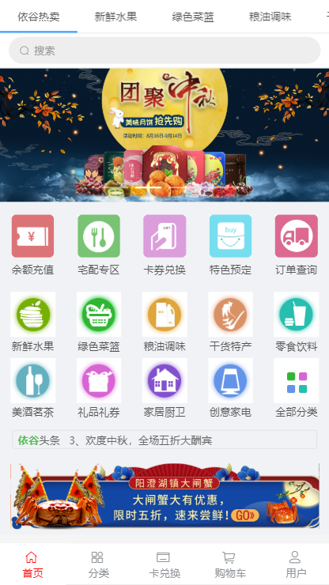
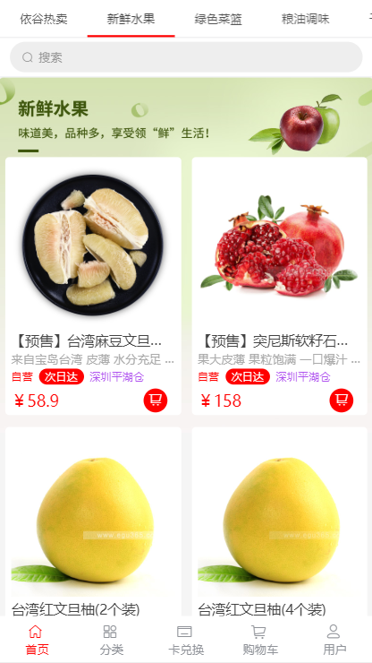
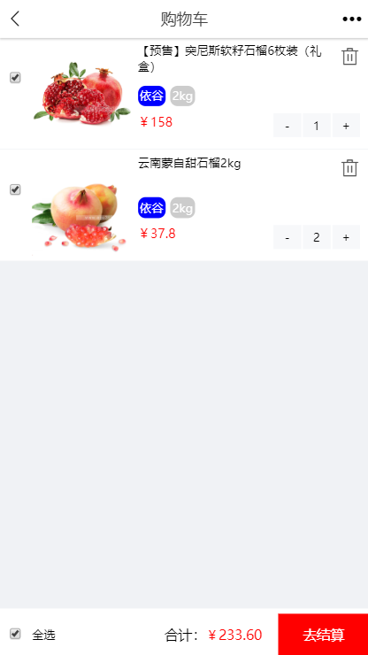
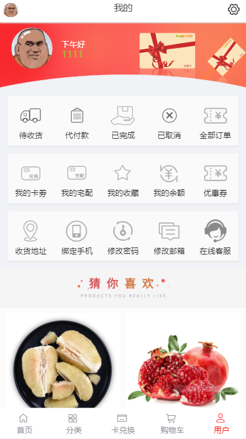

# 项目说明

基于Vue框架的webApp项目 + 后台管理系统

### 依谷网项目

### 项目类型
* 电商

##### 说明：一款区域内商品送货上门项目。
```
项目组成员：陈旭东，何启维，崔宇灏
```

##### 参考网址（依谷网官网）：http://m.egu365.cn

##### 演示网址（demo）：http://52.78.186.217:8888

##### 演示网址（后台）：http://52.78.186.217:8899

##### gitHub仓库项目地址：git@github.com:gzh51906/egw.git

##### 主要功能：首页、详情页、分类页、购物车、登陆、注册和后台管理。

### 项目分工
```
陈旭东：首页，详情页，卡兑换页，服务器&接口，数据库操作
何启维：用户User，购物车，登录，注册
崔宇灏：爬取数据，分类页
```

## 技术栈

##### 前端
* Vue
* Vue-Router
* Vuex
* Vue-Cli
* axios
* elementUI
* git

##### 后端
* Nodejs
* Express
* MongoDB

### 部分截图
   

### 项目目录
```
│  main.js
│  
├─assets                      // 图片文档
├─classify                    // 分类页目录
│      all.vue
│      apple.vue
│      cardli.vue
│      chuwei.vue
│      fruit.vue
│      ganhuo.vue
│      gift.vue
│      grape.vue
│      green.vue
│      hotfruit.vue
│      jiadian.vue
│      kiwi.vue
│      main.vue
│      mincha.vue
│      oil.vue
│      olther.vue
│      orange.vue
│      peach.vue
│      snacks.vue
│      
├─components
│      HelloWorld.vue
│      
├─Home                      // 首页分类页目录
│      Cardli.vue
│      Chuwei.vue
│      Fruit.vue
│      Ganhuo.vue
│      Green.vue
│      Hot.vue
│      Jiadian.vue
│      Main.vue
│      Mincha.vue
│      Oil.vue
│      Snacks.vue
│      
├─iconfont
│      font.css
│      
├─pages                     // 主要功能目录
│      Card.vue
│      Cart.vue
│      Classify.vue
│      Goods.vue
│      Home.vue
│      Login.vue
│      Mine.vue
│      Reg.vue
│      User.vue
│      
├─rem
│      index.js
│      
├─routers
│      index.js
│      
└─store
        index.js
        

```

